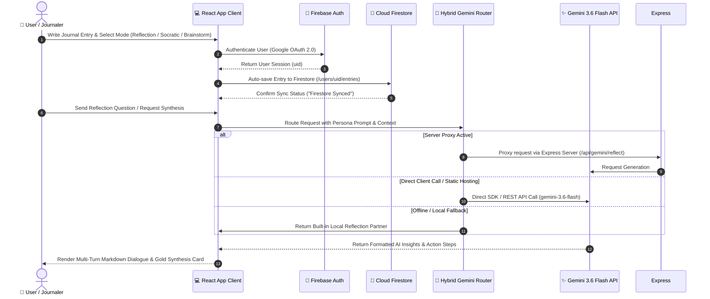
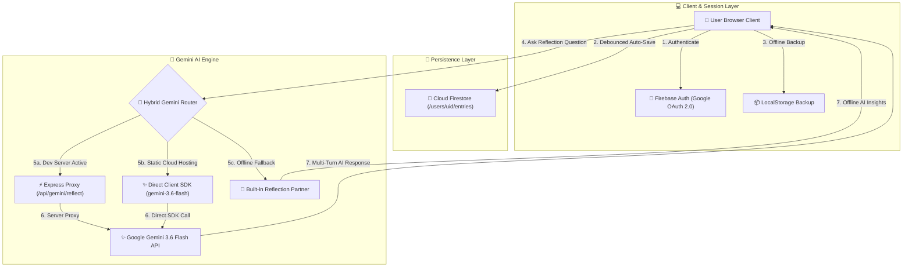

# 🌿 Reflections Journal — AI Reflection Sanctuary with Gemini 3.6 Flash & Cloud Firestore

A private, user-authenticated journaling and multi-turn AI reflection sanctuary powered by **Google Gemini 3.6 Flash**, **Firebase Authentication (Google Sign-In)**, and **Cloud Firestore**.

[](https://reflections-journal-1cd34.web.app)
[](https://github.com/shyamsm10/reflections-journal-using-gemini-)
[](https://aistudio.google.com/)

---

## 🌐 Live Application Links

- 🚀 **Primary Live Deployment**: [https://reflections-journal-1cd34.web.app](https://reflections-journal-1cd34.web.app)
- 🔗 **Secondary Domain**: [https://reflections-journal-1cd34.firebaseapp.com](https://reflections-journal-1cd34.firebaseapp.com)
- 📦 **GitHub Source Repository**: [https://github.com/shyamsm10/reflections-journal-using-gemini-](https://github.com/shyamsm10/reflections-journal-using-gemini-)

---

## 🏗️ System Architecture & Dialogue Flow

### 💬 Multi-Turn Dialogue Sequence Flow



### 🧩 System Data & Dialogue Flow Diagram



### Architecture Highlights:
1. **Federated Google Identity**: Passwordless Google Sign-In with browser local session persistence.
2. **Owner-Bound Cloud Firestore Isolation**: Data stored under `/users/userId/entries/...` with owner-only access rules.
3. **Hybrid Gemini AI Router**: Automatically tries Express backend server proxy, falls back to direct client API (`gemini-3.6-flash` $\rightarrow$ `gemini-1.5-flash`), and degrades gracefully to an intelligent offline Local Reflection Partner.
4. **Zero-Crash Payload Sanitization**: Strips `undefined` values recursively to prevent Firestore write crashes.

---

## 🚀 How to Run the Project (Step-by-Step)

### 📋 Prerequisites
- **Node.js**: `v18.0.0` or higher (Node v20+ recommended)
- **npm**: `v9.0.0` or higher
- **Git**: Installed on your system

---

### 1️⃣ Clone the Repository & Install Dependencies

```bash
# Clone the project from GitHub
git clone https://github.com/shyamsm10/reflections-journal-using-gemini-.git

# Navigate into the project folder
cd reflections-journal-using-gemini-

# Install all required npm packages
npm install
```

---

### 2️⃣ Configure Environment Variables

Create a file named **`.env`** in the root directory:

```env
# GEMINI_API_KEY: Required for live Gemini 3.6 Flash AI responses
GEMINI_API_KEY="YOUR_ACTUAL_GEMINI_API_KEY_FROM_AI_STUDIO"

# APP_URL: Service URL
APP_URL="http://localhost:3000"
```

> 💡 **How to get a free Gemini API Key**: Visit [aistudio.google.com/app/apikey](https://aistudio.google.com/app/apikey) and click **Create API Key**.

---

### 3️⃣ Start Development Server

Run the development server using:

```bash
npm run dev
```

The Express + Vite server will launch locally:
- 🌐 **App Access**: Open [http://localhost:3000](http://localhost:3000)
- 🩺 **Health Check**: Visit [http://localhost:3000/api/health](http://localhost:3000/api/health)

---

### 4️⃣ Build & Run for Production

To build the optimized production bundle and run the production server:

```bash
# 1. Compile TypeScript & Vite production bundle into /dist
npm run build

# 2. Run the production Node server
npm run start
```

---

## 📤 How to Deploy

### Option A: Deploy to Firebase Hosting (Recommended)

```bash
# 1. Install Firebase CLI globally (if not already installed)
npm install -g firebase-tools

# 2. Login to your Google / Firebase account
npx firebase login

# 3. Build production bundle
npm run build

# 4. Deploy hosting and security rules
npx firebase deploy --only hosting,firestore:rules
```

---

### Option B: Deploy to Render.com

1. Create a **New Web Service** on [Render.com](https://render.com).
2. Connect your GitHub repository `https://github.com/shyamsm10/reflections-journal-using-gemini-`.
3. Set build configuration:
   - **Build Command**: `npm install && npm run build`
   - **Start Command**: `npm run start`
   - **Environment Variable**: `GEMINI_API_KEY` = *your API key*

---

## 🛡️ Cloud Firestore Security Rules

Production security rules deployed at `firestore.rules`:

```javascript
rules_version = '2';
service cloud.firestore {
  match /databases/{database}/documents {
    // Private User Isolation: Users can ONLY read and write their own entries
    match /users/{userId} {
      allow read, write: if request.auth != null && request.auth.uid == userId;
      
      match /{allSubcollections=**} {
        allow read, write: if request.auth != null && request.auth.uid == userId;
      }
    }
  }
}
```

---

## 🌟 Key Features & Reflection Personas

- 🌿 **Deep Reflection Partner**: Uncovers core sentiments, emotional patterns, and guiding self-awareness questions.
- ✨ **Creative Ideation & Brainstorming**: Explores 3 distinct creative angles (Quick Wins, Unconventional Perspectives, Long-Term Visions).
- 🧠 **Socratic Inquiries**: Gently challenges cognitive biases and distinguishes facts from subjective interpretations.
- 📋 **Session Syntheses**: Distills Core Essence, Emotional Tone, Key Realizations, and Micro-Actions into an expandable gold card.
- 🎯 **Action Micro-Habits**: Converts daily thoughts into 10-minute friction-free micro-habits.
- 🔐 **Guest / Local Demo Mode**: Instant offline journaling saving directly to browser LocalStorage with zero cloud setup.
- 📊 **Activity & Insights Modal**: Real-time stats on word count, Gemini turns, mood distribution, and mode percentages.
- 📄 **Export Options**: Export reflections to Markdown (.md), Plain Text (.txt), or JSON (.json).

---

## 🧪 Functional Test Case Walkthrough

| Test ID | Feature | Interaction Steps | Expected Result |
| :--- | :--- | :--- | :--- |
| **TC-01** | Landing Page | Visit root URL unauthenticated. | Displays hero headline, security badges, and Google Sign-In / Guest Mode CTAs. |
| **TC-02** | Google Sign-In | Click **"Continue with Google"**. | Firebase Google Auth popup opens; authenticates user and redirects to private dashboard. |
| **TC-03** | Guest Demo Mode | Click **"Continue in Guest / Local Demo Mode"**. | Instant login as Guest; reflections persist to LocalStorage with zero cloud setup. |
| **TC-04** | Auto-Save Sync | Type text in journal editor. | Debounced auto-save triggers; sync badge transitions to "Firestore Synced". |
| **TC-05** | Reflection Mode | Toggle between *Deep Reflection*, *Brainstorming*, *Socratic*, or *Action*. | Workspace theme, mode placeholders, and prompt suggestions adapt dynamically. |
| **TC-06** | Gemini Dialogue | Send a reflection question in dialogue. | Gemini responds formatted in clean markdown with model attribution (`gemini-3.6-flash`). |
| **TC-07** | Session Summary | Click **"Summarize"** in toolbar. | Synthesizes Core Essence, Emotional Tone, Insights, and Micro-Actions. |
| **TC-08** | Export Reflection | Click **"Export"** $\rightarrow$ **Markdown (.md)**. | Downloads formatted `.md` file containing reflection, synthesis, and dialogue history. |

---

## 📋 Environment Variables Reference

| Variable | Scope | Purpose |
| :--- | :--- | :--- |
| `GEMINI_API_KEY` | Server & Client | API Key for Gemini 3.6 Flash generation. |
| `APP_URL` | Server-Side | Hosted application root URL. |
| `NODE_ENV` | Server-Side | Environment mode (`development` vs `production`). |

---

## 📄 License & Attribution

Built with ❤️ using **Google Gemini 3.6 Flash**, **Firebase Authentication**, and **Cloud Firestore**. 
© 2026 Reflections Journal. All rights reserved.
